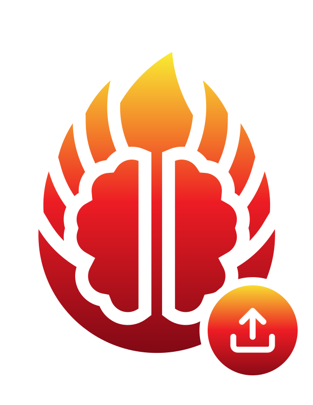

  
  <h1 align="center">BBQS Uploader</h1>
  

    
    
    
  

  

    
    
  

A **fully static, backend-free** web app for BBQS teams to upload files to an existing Dandiset on the EMBER Archive through a simple drag-and-drop interface.

---

Built &amp; maintained by the [Center for Open Neuroscience](https://centerforopenneuroscience.org).
